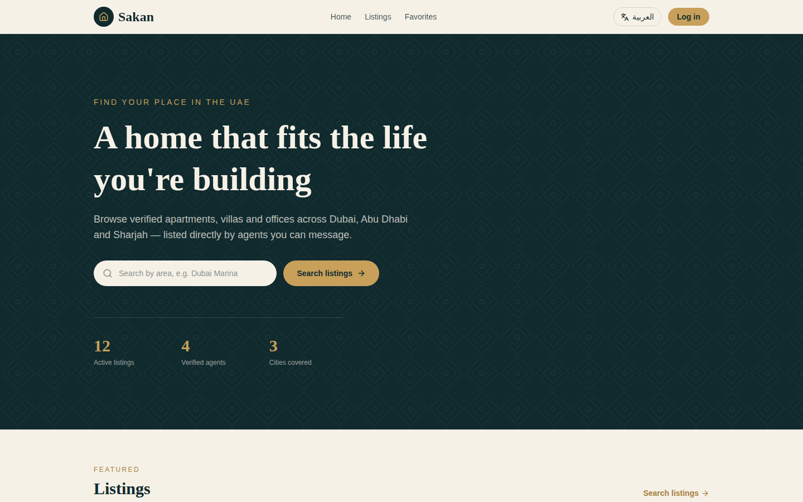
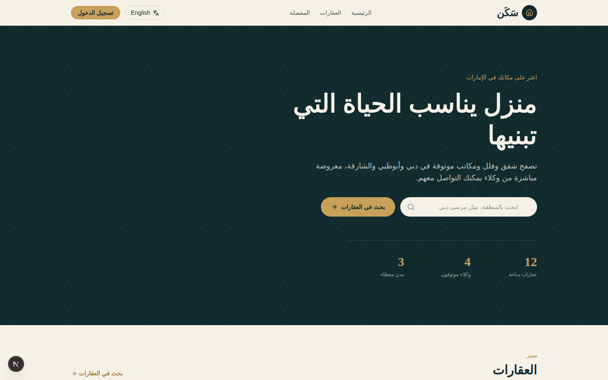
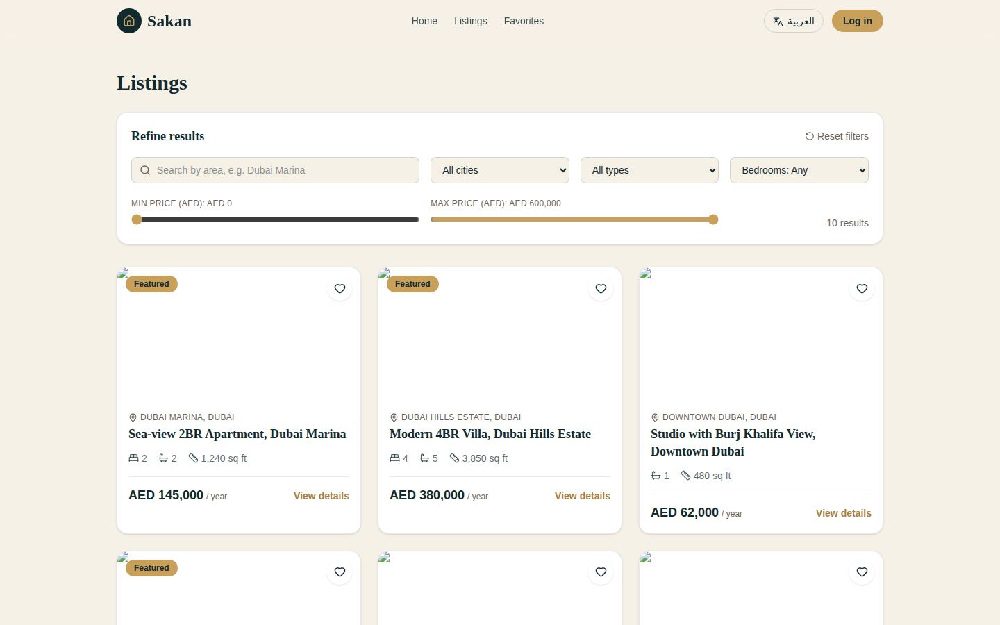
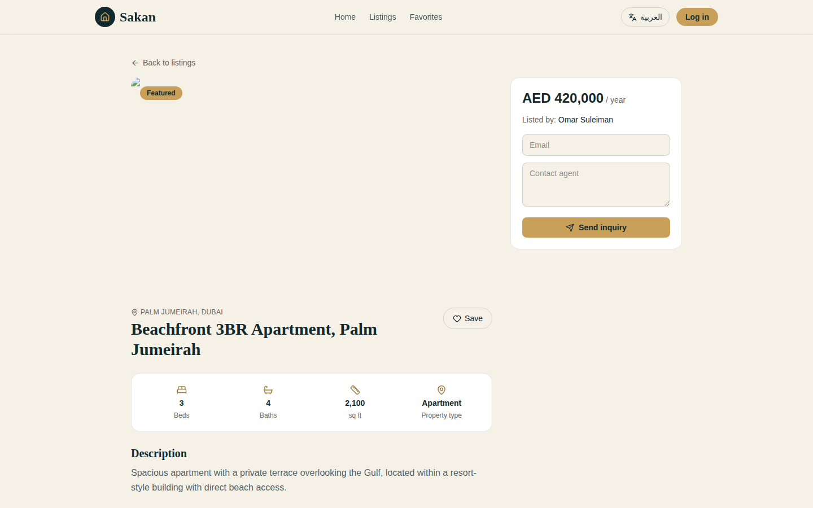
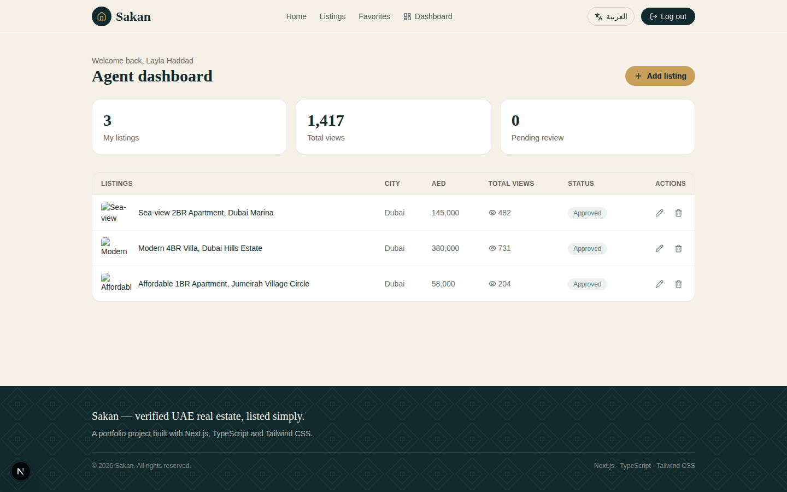
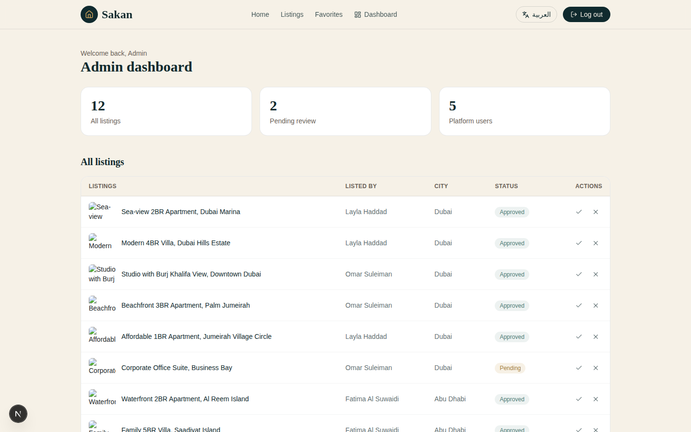

<div align="center">

# 🏠 Sakan — سَكَن
### Bilingual UAE Property Marketplace

**[🌐 Live Demo](https://sakan-portal.vercel.app)** · **[📂 GitHub](https://github.com/rohinigaikwad7057/sakan-portal)** · **[👩‍💻 LinkedIn](https://www.linkedin.com/in/rohini-gaikwad7057/)**


> Built by **[Rohini Gaikwad](https://www.linkedin.com/in/rohini-gaikwad7057/)** — Frontend Developer · UAE Market Focused · 3.6 years experience

</div>

---

## 📌 What is Sakan?

**Sakan** (سَكَن — Arabic for *dwelling/home*) is a production-ready bilingual property marketplace for the UAE, inspired by platforms like **Property Finder** and **Bayut**.

It demonstrates real-world Next.js 15 architecture — server components, dynamic routing, role-based dashboards, bilingual EN/AR with full RTL layout, and a clean design system inspired by UAE aesthetics (mashrabiya lattice pattern, gold/ink palette).

> 💡 No database or `.env` file needed — runs entirely on mock data out of the box.

---

## 🖼️ Screenshots

| Home (English LTR) | Home (Arabic RTL) |
|---|---|
|  |  |

| Listings & Filters | Listing Detail |
|---|---|
|  |  |

| Agent Dashboard | Admin Dashboard |
|---|---|
|  |  |

---

## ✨ Features

### 🌐 Bilingual & RTL Support
- One-click **English ↔ Arabic** language toggle
- Full **RTL layout flip** — navbar, cards, buttons, text alignment, arrow directions all mirror automatically
- **IBM Plex Sans Arabic** font loads for Arabic mode
- Language preference **persisted in localStorage** across sessions
- Brand name switches: **Sakan** → **سَكَن**

### 🏘️ Property Listings
- **12 real UAE listings** across Dubai, Abu Dhabi and Sharjah
- All listings have **bilingual titles, descriptions and location data**
- Properties include Apartments, Villas, Townhouses and Offices
- Featured listings highlighted with gold badge
- Listing detail page with image, stats (beds/baths/sqft/type), description and inquiry form

### 🔍 Search & Filter
- Search by **area or keyword** (matches both EN and AR text)
- Filter by **City**, **Property Type**, **Bedrooms**
- **Price range sliders** (Min/Max AED)
- Filters **sync with URL search params** — results are shareable and bookmarkable
- Live **result counter** updates as you filter

### ❤️ Favorites
- Save/unsave any listing with the heart icon
- Favorites **persist in localStorage** — survive page refresh
- Dedicated `/favorites` page showing all saved listings

### 🔐 Role-Based Auth & Dashboards
- Three roles: **Visitor**, **Agent**, **Admin**
- One-click demo login (no signup needed)
- **Agent Dashboard** — my listings table, total views, pending count, edit/delete actions
- **Admin Dashboard** — approve/reject pending listings, view all platform users
- Protected routes — unauthenticated users are redirected to login

### 🎨 Design System
- Custom **gold/ink/sand** color palette
- **Mashrabiya-inspired lattice** SVG pattern (UAE architectural motif)
- **Fraunces** serif for display headings, **Plus Jakarta Sans** for body text
- Consistent **focus rings** for keyboard accessibility
- **Reduced-motion** support via `@media (prefers-reduced-motion)`

---

## 🛠️ Tech Stack

| Category | Technology | Why |
|---|---|---|
| Framework | Next.js 15 (App Router) | SSR, dynamic routing, server components |
| Language | TypeScript | Type safety, better DX, fewer runtime bugs |
| Styling | Tailwind CSS v4 | Utility-first, RTL logical properties, fast |
| State Management | React Context API | Right-sized for 3 isolated concerns (locale, auth, favorites) |
| Icons | Lucide React | Clean, consistent, tree-shakeable |
| Fonts | Google Fonts (Fraunces · Plus Jakarta Sans · IBM Plex Sans Arabic) | Bilingual typography |
| Database (reference) | Prisma + PostgreSQL | Production schema ready to connect |
| Deployment | Vercel | Edge network, zero-config Next.js |

---

## 🚀 Getting Started

```bash
# 1. Clone the repo
git clone https://github.com/rohinigaikwad7057/sakan-portal.git
cd sakan-portal

# 2. Install dependencies
npm install

# 3. Run the dev server
npm run dev

# 4. Open in browser
# http://localhost:3000
```

> ✅ No `.env` file needed · No database setup · No API keys · Works immediately

---

## 🔑 Demo Accounts

Visit [/login](https://sakan-portal.vercel.app/login) and click any demo button — no signup required:

| Role | Email | What you can do |
|---|---|---|
| **Visitor** | visitor@sakan.ae | Browse listings, search & filter, save favorites |
| **Agent** (Layla Haddad) | layla@sakan.ae | Everything above + Agent Dashboard (my listings, stats, edit/delete) |
| **Admin** | admin@sakan.ae | Everything above + Admin Dashboard (approve/reject listings, manage users) |

---

## 📁 Project Structure

```
sakan-portal/
│
├── app/                              # Next.js App Router
│   ├── layout.tsx                    # Root layout — providers, navbar, footer
│   ├── page.tsx                      # Home — hero + featured listings
│   ├── listings/
│   │   ├── page.tsx                  # Search & filter (useSearchParams + useMemo)
│   │   └── [id]/page.tsx             # Dynamic listing detail page
│   ├── favorites/page.tsx            # Saved listings page
│   ├── login/page.tsx                # Mock auth with demo role accounts
│   └── dashboard/
│       ├── agent/page.tsx            # Agent dashboard (listings, stats, actions)
│       └── admin/page.tsx            # Admin dashboard (moderation, users)
│
├── components/
│   ├── Navbar.tsx                    # Auth-aware, mobile responsive, RTL-ready
│   ├── Footer.tsx                    # With lattice dark pattern
│   ├── Hero.tsx                      # Homepage hero with live stats
│   ├── ListingCard.tsx               # Reusable card — image, stats, save button
│   ├── FilterBar.tsx                 # Search + dropdowns + price range sliders
│   └── LanguageSwitcher.tsx          # EN ↔ AR toggle
│
├── context/
│   ├── LanguageContext.tsx           # Locale state, dir switch, localStorage
│   ├── AuthContext.tsx               # User state, role management, localStorage
│   └── FavoritesContext.tsx          # Saved listing IDs, localStorage
│
├── data/
│   └── listings.ts                   # 12 bilingual mock listings (UAE)
│
├── lib/
│   ├── types.ts                      # Shared TypeScript interfaces & enums
│   └── translations.ts               # Full EN/AR string dictionary (typed)
│
├── prisma/
│   └── schema.prisma                 # Reference DB schema (User, Listing, Favorite)
│
└── screenshots/                      # README images
```

---

## 🧠 Key Technical Decisions

### Why React Context instead of Redux or Zustand?
The app has three isolated state concerns — language, auth, and favorites — with no cross-slice dependencies. Context is the right tool at this scale. Adding Zustand would be over-engineering for what's essentially three independent stores.

### Why URL params for filter state?
Syncing filters with `useSearchParams` means filtered results are shareable via URL, bookmarkable, and survive page refresh. This is the same pattern Bayut and Property Finder use — paste a filtered URL and the recipient sees the same results.

### Why `document.documentElement.dir` for RTL?
Setting `dir="rtl"` at the HTML root element level means CSS logical properties (`ms-`, `me-`, `ps-`, `pe-`) cascade to every component automatically. No per-component RTL logic needed — one toggle switches everything.

### Why mock data instead of a real database?
Zero-dependency demo — anyone can clone and run it in 2 minutes. The included `prisma/schema.prisma` shows exactly how to swap in Postgres. The data shape is already production-ready — it's just a matter of wiring the context calls to API routes.

### Why server components for listings pages?
Listing pages benefit from SSR for SEO — Google can index property titles, descriptions and prices without JavaScript. Interactive parts (filter bar, favorite button, inquiry form) are isolated as client components.

---


## 🗺️ Roadmap

These are the natural next steps to take this to production:

- [ ] Replace mock auth with **NextAuth.js** (credentials + Google OAuth)
- [ ] Connect real database using the included **Prisma schema** (Supabase or Railway — free tier)
- [ ] Move translations to **next-intl** with locale-based routing (`/en/...`, `/ar/...`)
- [ ] **Image uploads** for agent-submitted listings (Cloudinary or UploadThing)
- [ ] Real-time **buyer ↔ agent chat** (Pusher or Socket.io)
- [ ] **Email notifications** when a saved search gets a new match (Resend + cron job)
- [ ] **Map view** for listings (Mapbox or Google Maps)
- [ ] **Analytics dashboard** for agents (views over time — Recharts)


---

<div align="center">

### Built By ❤️ by Rohini Gaikwad

**Frontend Developer · 3.5+ Years Experience · UAE Market Focused**

[](https://www.linkedin.com/in/rohini-gaikwad7057/)
[](https://github.com/rohinigaikwad7057)
[](https://sakan-portal.vercel.app)

*If this project helped you, consider giving it a ⭐ on GitHub!*

</div>
